# 🛡️ Cyber Insurance Risk Underwriting Model

## 📌 Project Overview
This project simulates an end-to-end Machine Learning Engineering pipeline for a Cyber Insurance provider. The objective is to predict the probability of a prospective corporate client experiencing a catastrophic cyber breach (and filing an insurance claim) based on their firmographics, security posture, and data exposure.

By accurately predicting this risk, insurance underwriters can dynamically price premiums, mandate security improvements (like MFA), or deny coverage to high-risk applicants.

## 🏗️ System Architecture & Data Pipeline

```mermaid
graph LR
    %% Define Nodes
    subgraph Data Engineering
    A[Collect Data] -->|Input 4 CSVs| B[(PostgreSQL)]
    B -->|4 Relational Tables| B1(Schema: public)
    end

    subgraph Data Science
    B1 -->|SQLAlchemy JOIN| C[Pandas DataFrame]
    C -->|wrangle_function| D[Clean & Preprocess]
    D -->|Drop Leaks| E[Cleaned Dataset]
    end

    subgraph Machine Learning
    E --> F[Data Split]
    F --> G[sklearn Pipeline]
    G -->|1| H[OrdinalEncoder]
    H -->|2| I[SimpleImputer]
    I -->|3| J[DecisionTree]
    end
    
    %% Styling
    style B fill:#336791,stroke:#fff,stroke-width:2px,color:#fff
    style G fill:#f9a826,stroke:#fff,stroke-width:2px,color:#fff
    style J fill:#2ca02c,stroke:#fff,stroke-width:2px,color:#fff
```

## 🛠️ Tech Stack
- **Database:** PostgreSQL (Relational Data Storage)
- **Language:** Python 3.12
- **Libraries:** - `Pandas` & `NumPy` (Data Manipulation)
    - `SQLAlchemy` & `psycopg2` (Database Connectivity)
    - `Scikit-Learn` (Machine Learning & Pipelines)
    - `Seaborn` & `Matplotlib` (Visualization)
    - `Category Encoders` (Feature Engineering)

## 🗄️ Data Engineering
Data was extracted from 4 relational tables. The `wrangle` function implements several critical R&D steps:
- **Leakage Prevention:** Removed features known only *after* a breach (e.g., `total_loss_val`, `records_stolen`).
- **Multicollinearity:** Dropped highly correlated features like `employee_count` to stabilize the model.
- **Database Integration:** Utilized SQLAlchemy engines to bypass `PrettyTable` rendering limitations in local environments.

## 📈 Key Insights from EDA
- **Healthcare Risk:** The Healthcare sector shows a significantly higher claim rate (~58%) compared to the baseline (~35%).
- **Size vs Risk:** Annual revenue and PII count are primary drivers of claim frequency.
- **Security Posture:** Companies using specific backup types and having lower security scores showed a measurable increase in claim probability.

## 🤖 Model Performance
I implemented a **Decision Tree Classifier** within a Scikit-Learn Pipeline.
- **Validation Strategy:** 3-way split (Train/Validation/Test).
- **Optimization:** Performed hyperparameter tuning on `max_depth` to prevent overfitting.
- **Training Accuracy:** 0.78%
- **Validation Accuracy:** 0.77%

## 🚀 How to Run
1. Ensure a PostgreSQL instance is running with the `cyber_insurance` database.
2. Update the connection string in `readind_sql_data.ipynb`.
3. Run the SQL notebook to generate `cleaned_cyber_insurance_data.csv`.
4. Run `insurance_model.ipynb` to train and evaluate the model.

---
**Author:** Muhammed Abdo 
**Field:**  Data Science
